# 数据库

# 第一章：绪论

## 1.1数据库基本概念

**数据**data：描述事物的符号，数据库存储的基本对象。

**数据库**DataBase,DB:计算机内有组织可共享的大量数据的集合。

**数据库管理系统**DataBase Management System,DBMSL：位于用户和操作系统之间的一层数据管理软件。

**数据库系统**DataBase System,DBS：由数据库，数据库管理系统，应用程序和数据库管理员(DBA)组成。

## 1.2数据库的特点

**数据结构化，数据共享性高，冗余度低而且容易扩充，数据独立性高**：物理独立性（应用程序与物理存储相互独立，数据的物理存储改变，应用程序不改变），逻辑独立性（应用程序与逻辑结构相互独立,数据的逻辑结构改变,应用程序不改变）。

## 1.3数据模型

数据模型包括**概念模型**(信息模型）和**逻辑模型**/**物理模型**。

概念模型按用户的观点建模，用于数据库设计，表示方法有E-R模型。

逻辑模型按计算机的观点建模，用于DBMS实现，包括网状模型、层次模型、关系模型等等。

物理模型是对数据最底层的抽象。

**数据模型的组成要素：数据结构，数据操作，数据的完整性约束条件**

1.数据结构:描述系统的静态特性→描述数据库的**组成对象**以及对象之间的**联系**
2.数据操作:描述系统的动态特性→是对数据库中各种对象的实例所允许的**操作的集合**，其类型有**查询和更新(增删改)**
3.数据的完整性约束条件:用以限定符合数据模型的**数据库状态**以及**状态的变化**，以保证数据的正确、有效与相容，完整性约束条件是一组完整性规则的集合

## 1.4数据库系统的三级模式结构：外模式，模式（逻辑模式），内模式

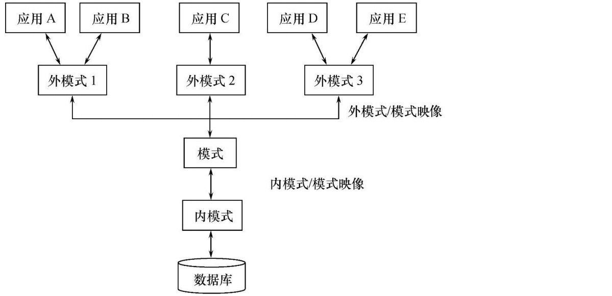

> 1.**外模式**(子模式/用户模式)：数据库用户能够看见和使用的局部数据的逻辑结构和特征的描述，数据库用户的数据视图，是与某应用有关的数据的逻辑表示。
> 2.**模式**(逻辑模式)：数据库中全体数据的逻辑结构和特征的描述，是所有用户的公共数据视图。
>
> 3.**内模式**(存储模式)：数据物理结构和存储方法的描述，是数据在数据库内部的组织方式。

# 第二章：关系数据库

​	**关系数据库**是一种基于**关系模型**的数据库管理系统（DBMS）。在关系数据库中，数据以**表**（或称为关系）的形式进行组织和存储。每个表都由行和列组成，其中每一行代表一个记录，每一列代表一个属性或字段。

## 2.1关系数据结构及形式化定义

1. **关系**：关系是关系数据库中最基本的数据结构，通常用表格（或称为关系）的形式来表示。每个表格都由行和列组成，其中每一行代表一个记录（元组），每一列代表一个属性（字段）。
2. **属性**：属性是关系中的列，每个属性具有一个名称和一个域（取值范围）。
3. **域**：域是属性的取值范围，可以是整数、字符、日期等类型。域的形式化定义取决于其具体类型。
4. **主键**：主键是关系中用来唯一标识每个记录的属性（或属性组合），它的值在整个关系中必须是唯一的。
5. **外键**：外键是关系中用来建立表之间关系的属性，它引用了另一个表中的主键，用于建立表之间的参照完整性约束。
6. **关系操作**：关系操作是对关系进行的操作，包括选择、投影、连接、并、交、差，笛卡尔积等操作，这些操作通过关系代数或关系演算来定义和实现。

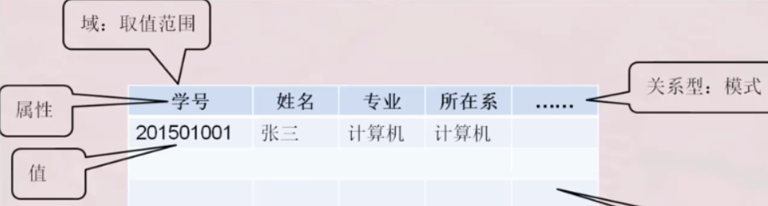

## 2.2关系代数

### **关系代数语言**

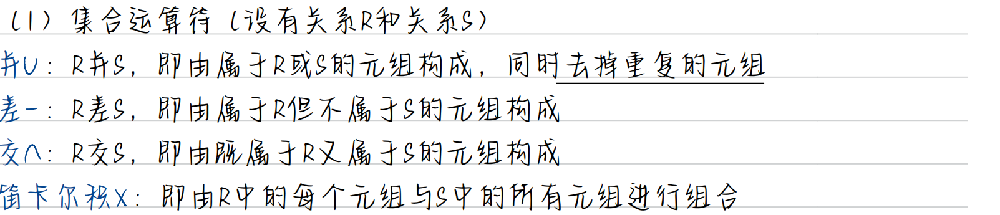

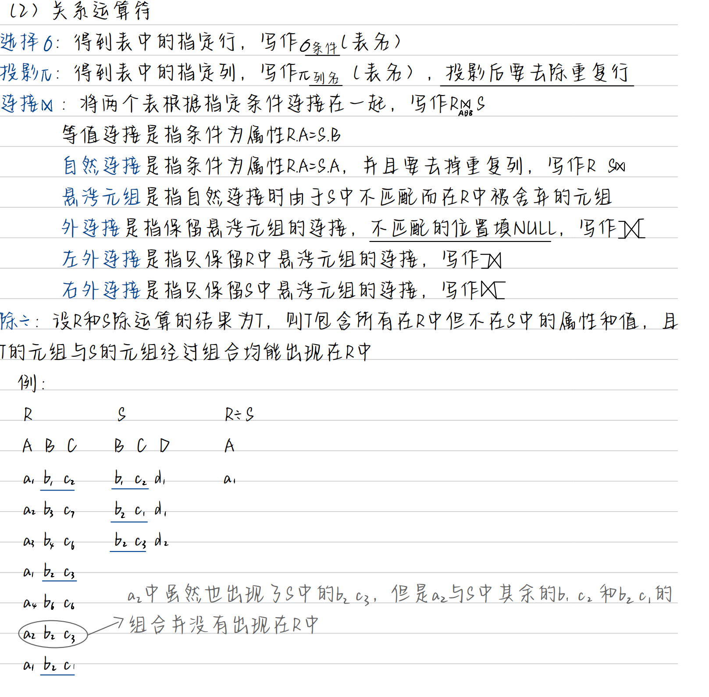

### 关系代数解题方法

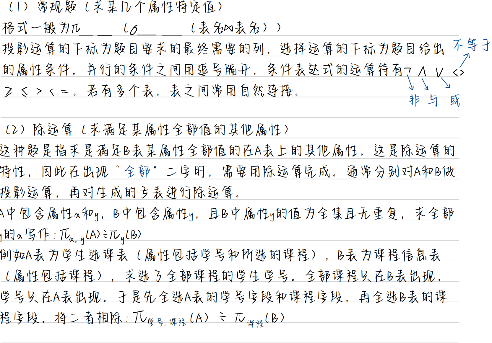

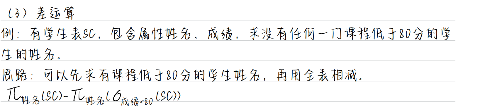

## 2.3关系演算

关系演算是一种用于描述和处理关系数据库中数据的形式化语言，它包括元组关系演算和域关系演算两种主要形式。

关系演算提供了一种形式化的描述方式，可以清晰地表达关系数据库中的查询需求，并且具有严格的数学基础，可以进行形式化推理和证明。通过使用关系演算，可以实现对关系数据库中数据的灵活查询和操作。

# 第三章：关系数据库编程语言SQL

(Structure Query Language 结构化查询语言)，它是对关系型数据库的操作语言。它可以应用到所有关系型数据库中，例如：MySQL、Oracle、SQL Server 等。

## 3.1SQL 分类

- DDL（Data Definition Language）：数据定义语言，用来定义数据库对象：库、表、列等；
- DML（Data Manipulation Language）：数据操作语言，用来定义数据库记录（数据）；
- DCL（Data Control Language）：数据控制语言，用来定义访问权限和安全级别；
- DQL（Data Query Language）：数据查询语言，用来查询记录（数据）

## 3.2DDL：数据定义语言

### 基本操作

查看所有数据库：show databases；

切换数据库：use mydb1，切换到 mydb1 数据库；

### 1.操作数据库

1. 创建数据库：CREATE DATABASE [IF NOT EXISTS] mydb1；

例如：`CREATE DATABASE mydb1`，创建一个名为 mydb1 的数据库。如果这个数据已经存在，那么会报错。
例如 `CREATE DATABASE IF NOT EXISTSmydb1`，在名为 mydb1 的数据库不存在时创建该库，这样可以避免报错。

------

1. 删除数据库：DROP DATABASE [IF EXISTS] mydb1；

例如：`DROP DATABASE mydb1`，删除名为 mydb1 的数据库。如果这个数据库不存在，那么会报错。DROP DATABASE IF EXISTS mydb1，就算 mydb1不存在，也不会的报错。

------

1. 修改数据库编码：ALTER DATABASE mydb1 CHARACTER SET utf8

修改数据库 mydb1 的编码为 utf8。注意，在 MySQL 中所有的 UTF-8 编码都
不能使用中间的`“-”`，即 UTF-8 要书写为 UTF8。

------

### 2.数据类型

MySQL 与 Java、C 一样，也有数据类型MySQL 中数据类型主要应用在列上。
常用类型：

- **int**：整型
- **double**：浮点型，例如 double(5,2)表示最多 5 位，其中必须有 2 位小数，即最大值为 999.99；
- **decimal**：泛型型，在表单线方面使用该类型，因为不会出现精度缺失问题；
- **char**：固定长度字符串类型；(当输入的字符不够长度时会补空格)
- **varchar**：固定长度字符串类型；
- **text**：字符串类型；
- **blob**：字节类型；
- **date**：日期类型，格式为：yyyy-MM-dd；
- **time**：时间类型，格式为：hh:mm:ss
- **timestamp**：时间戳类型；

### 3.操作表

创建表

```sql
CREATE TABLE 表名(
	列名 列类型, 
	列名 列类型,
	...... 
);
12345
```

例如，创建stu表

```sql
CREATE TABLE stu(
	sid CHAR(6), 
	sname VARCHAR(20), 
	age INT, 
	gender VARCHAR(10)
);
123456
```

查看表的结构

DESC 表名；

删除表

DROP TABLE 表名；

修改表

1. 添加列：给 stu 表添加 classname 列
   `ALTER TABLE stu ADD (classname varchar(100));`
2. 修改列的数据类型：修改 stu 表的 gender 列类型为 CHAR(2)
   `ALTER TABLE stu MODIFY gender CHAR(2);`
3. 修改列名：修改 stu 表的 gender 列名为 sex
   `ALTER TABLE stu change gender sex CHAR(2);`
4. 删除列：删除 stu 表的 classname 列
   `ALTER TABLE stu DROP classname;`
5. 修改表名称：修改 stu 表名称为 student
   `ALTER TABLE stu RENAME TO student;`

------

## 3.3DML：数据操作语言

### 1.插入数据

语法 1：
`INSERT INTO 表名(列名 1,列名 2, …) ;`

```sql
INSERT INTO stu(sid, sname,age,gender) VALUES('s_1001', 'zhangSan', 23, 'male');
1
INSERT INTO stu(sid, sname) VALUES('s_1001', 'zhangSan');
1
```

语法 2：
`INSERT INTO 表名 VALUES(值 1,值 2,…);`
因为没有指定要插入的列，表示按创建表时列的顺序插入所有列的值：

```sql
INSERT INTO stu VALUES('s_1002', 'liSi', 32, 'female');
1
```

**注意：所有字符串数据必须使用单引用！**

### 2.修改数据

语法：
`UPDATE 表名 SET 列名 1=值 1, … 列名 n=值 n [WHERE 条件];`

```sql
UPDATE stu SET sname=’zhangSanSan’, age=’32’, gender=’female’ WHERE sid=’s_1001’;
UPDATE stu SET sname=’liSi’, age=’20’WHERE age>50 AND gender=’male’;
UPDATE stu SET sname=’wangWu’, age=’30’WHERE age>60 OR gender=’female’;
UPDATE stu SET gender=’female’WHERE gender IS NULL
UPDATE stu SET age=age+1 WHERE sname=’zhaoLiu’;
12345
```

### 3.删除数据

语法 1：
`DELETE FROM 表名 [WHERE 条件];`

```sql
DELETE FROM stu WHERE sid=’s_1001’003B;
DELETE FROM stu WHERE sname=’chenQi’ OR age > 30;
DELETE FROM stu;
123
```

语法 2：
TRUNCATE TABLE 表名;

```sql
TRUNCATE TABLE stu;
1
```

两者之间的区别：
虽然 TRUNCATE 和 DELETE 都可以删除表的所有记录，但有原理不同。DELETE的效率没有 TRUNCATE 高！
TRUNCATE 其实属性 DDL 语句，因为它是先 DROP TABLE，再 CREATE TABLE。
而且TRUNCATE删除的记录是无法回滚的，但DELETE删除的记录是可以回滚的（回滚是事务的知识！）。

------

## 3.4DCL：数据控制语言

### 1.创建用户

语法：
`CREATE USER ‘用户名’@地址 IDENTIFIED BY '密码';`

```sql
CREATE USER ‘user1’@localhost IDENTIFIED BY ‘123’;
CREATE USER ‘user2’@’%’ IDENTIFIED BY ‘123’;
12
```

### 2.给用户授权

语法：
`GRANT 权限 1, … , 权限 n ON 数据库.* TO ‘用户名’@地址;`

```sql
GRANT CREATE,ALTER,DROP,INSERT,UPDATE,DELETE,SELECT ON mydb1.* TO 'user1'@localhost;
GRANT ALL ON mydb1.* TO user2@localhost;
12
```

### 3.撤销授权

语法：
`REVOKE 权限 1, … , 权限 n ON 数据库.* FROM ‘用户名’@地址;`

```sql
REVOKE CREATE,ALTER,DROP ON mydb1.* FROM 'user1'@localhost;
1
```

### 4.查看用户权限

语法：
`SHOW GRANTS FOR ‘用户名’@地址;`

```sql
SHOW GRANTS FOR 'user1'@localhost;
1
```

### 5.删除用户

语法：
`DROP USER ‘用户名’@地址;`

```sql
DROP USER ‘user1’@localhost;
1
```

### 6.修改用户密码（以root身份）

语法 ：
`use mysql;`
`alter user '用户名'@localhost identified by '新密码';`

------

## 3.5DQL：数据查询语言

数据库执行 DQL 语句不会对数据进行改变，而是让数据库发送结果集给客户端。

语法：
select 列名 ----> 要查询的列名称
from 表名 ----> 要查询的表名称
where 条件 ----> 行条件
group by 分组列 ----> 对结果分组
having 分组条件 ----> 分组后的行条件
order by 排序列 ----> 对结果分组
limit 起始行, 行数 ----> 结果限定

### 创建数据库：Info，在 Info 下创建如下表：

☆学生表：stu：

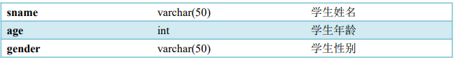

```sql
CREATE TABLE stu (
	sid CHAR(6), 
	sname VARCHAR(50), 
	age INT, 
	gender VARCHAR(50)
);
INSERT INTO stu VALUES('S_1001', 'liuYi', 35, 'male');
INSERT INTO stu VALUES('S_1002', 'chenEr', 15, 'female');
INSERT INTO stu VALUES('S_1003', 'zhangSan', 95, 'male');
INSERT INTO stu VALUES('S_1004', 'liSi', 65, 'female');
INSERT INTO stu VALUES('S_1005', 'wangWu', 55, 'male');
INSERT INTO stu VALUES('S_1006', 'zhaoLiu', 75, 'female');
INSERT INTO stu VALUES('S_1007', 'sunQi', 25, 'male');
INSERT INTO stu VALUES('S_1008', 'zhouBa', 45, 'female');
INSERT INTO stu VALUES('S_1009', 'wuJiu', 85, 'male');
INSERT INTO stu VALUES('S_1010', 'zhengShi', 5, 'female');
INSERT INTO stu VALUES('S_1011', 'xxx', NULL, NULL);
1234567891011121314151617
```

☆雇员表：emp
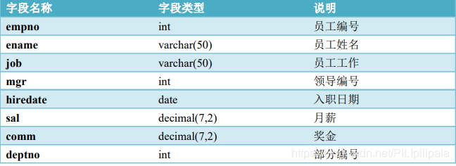

```sql
CREATE TABLE emp(
	empno INT, 
	ename VARCHAR(50), 
	job VARCHAR(50), 
	mgr INT, 
	hiredate DATE,
	sal DECIMAL(7,2), 
	comm decimal(7,2), 
	deptno INT
) ;
INSERT INTO emp values(7369,'SMITH','CLERK',7902,'1980-12-17',800,NULL,20);
INSERT INTO emp values(7499,'ALLEN','SALESMAN',7698,'1981-02-20',1600,300,30);
INSERT INTO emp values(7521,'WARD','SALESMAN',7698,'1981-02-22',1250,500,30);
INSERT INTO emp values(7566,'JONES','MANAGER',7839,'1981-04-02',2975,NULL,20);
INSERT INTO emp values(7654,'MARTIN','SALESMAN',7698,'1981-09-28',1250,1400,30);
INSERT INTO emp values(7698,'BLAKE','MANAGER',7839,'1981-05-01',2850,NULL,30);
INSERT INTO emp values(7782,'CLARK','MANAGER',7839,'1981-06-09',2450,NULL,10);
INSERT INTO emp values(7788,'SCOTT','ANALYST',7566,'1987-04-19',3000,NULL,20);
INSERT INTO emp values(7839,'KING','PRESIDENT',NULL,'1981-11-17',5000,NULL,10);
INSERT INTO emp values(7844,'TURNER','SALESMAN',7698,'1981-09-08',1500,0,30);
INSERT INTO emp values(7876,'ADAMS','CLERK',7788,'1987-05-23',1100,NULL,20);
INSERT INTO emp values(7900,'JAMES','CLERK',7698,'1981-12-03',950,NULL,30);
INSERT INTO emp values(7902,'FORD','ANALYST',7566,'1981-12-03',3000,NULL,20);
INSERT INTO emp values(7934,'MILLER','CLERK',7782,'1982-01-23',1300,NULL,10);
123456789101112131415161718192021222324
```

☆部门表：dept
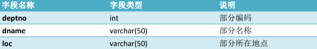

```sql
CREATE TABLE dept(
	deptno INT, 
	dname varchar(14),
	loc varchar(13)
);
INSERT INTO dept values(10, 'ACCOUNTING', 'NEW YORK');
INSERT INTO dept values(20, 'RESEARCH', 'DALLAS');
INSERT INTO dept values(30, 'SALES', 'CHICAGO');
INSERT INTO dept values(40, 'OPERATIONS', 
123456789
```

### 1.基础查询

查询所有列
`SELECT * FROM 表名;`
(* ：通配符，表示所有列)

```sql
SELECT * FROM stu;
1
```

查询指定列
`SELECT 列名 1, 列名 2, …列名 n FROM 表名;`

```sql
SELECT sid, sname, age FROM stu;
1
```

### 2.条件查询

条件查询介绍
条件查询就是在查询时给出 WHERE 子句，在 WHERE 子句中可以使用如下运算符及关键字：

- =、!=、<>、<、<=、>、>=；
- BETWEEN…AND；
- IN(set)；
- IS NULL；
- AND；
- OR；
- NOT；

举例说明
查询性别为女，并且年龄小于 50 的记录
`SELECT * FROM stu`
`WHERE gender='female' AND age<50;`

查询学号为 S_1001，或者姓名为 liSi 的记录
`SELECT * FROM stu`
`WHERE sid ='S_1001' OR sname='liSi';`

查询学号为 S_1001，S_1002，S_1003 的记录
`SELECT * FROM stu`
`WHERE sid IN ('S_1001','S_1002','S_1003')`

查询学号不是 S_1001，S_1002，S_1003 的记录
`SELECT * FROM stu`
`WHERE sid NOT IN ('S_1001','S_1002','S_1003');`

查询年龄为 null 的记录
`SELECT * FROM stu`
`WHERE age IS NULL;`

查询年龄在 20 到 40 之间的学生记录
`SELECT * FROM stu`
`WHERE age>=20 AND age<=40;`
或者
`SELECT * FROM stu`
`WHERE age BETWEEN 20 AND 40;`

查询性别非男的学生记录
`SELECT * FROM stu`
`WHERE gender!='male';`
或者
`SELECT * FROM stu`
`WHERE gender<>'male';`
或者
`SELECT * FROM stu`
`WHERE NOT gender='male';`

查询姓名不为 null 的学生记录
`SELECT * FROM stu`
`WHERE NOT sname IS NULL;`
或者
`SELECT * FROM stu`
`WHERE sname IS NOT NULL;`

------

### 3.模糊查询

`SELECT 字段 FROM 表 WHERE 某字段 Like 条件`
其中关于条件，SQL 提供了两种匹配模式：

1. `%` ：表示任意 0 个或多个字符。可匹配任意类型和长度的字符，有些情
   况下若是中文，请使用两个百分号（%%）表示。
2. `_ `： 表示任意单个字符。匹配单个任意字符，它常用来限制表达式的字 符长度语句。

举例说明
查询姓名由 5 个字母构成的学生记录
`SELECT * FROM stu`
`WHERE sname LIKE '_ _ _ _ _';`

查询姓名由 5 个字母构成，并且第 5 个字母为“i”的学生记录
`SELECT * FROM stu`
`WHERE sname LIKE '_ _ _ _i';`

查询姓名以“z”开头的学生记录
`SELECT * FROM stu`
`WHERE sname LIKE 'z%';`
其中“%”匹配 0~n 个任何字母。

查询姓名中第 2 个字母为“i”的学生记录
`SELECT * FROM stu`
`WHERE sname LIKE '_i%';`

\查询姓名中包含“a”字母的学生记录
`SELECT * FROM stu WHERE sname LIKE '%a%';`

### 4.字段控制查询

去掉重复记录
去除重复记录（两行或两行以上记录中系列的上的数据都相同），例如 emp 表中 sal 字段就存在相同的记录。当只查询 emp 表的 sal 字段时，那么会出现重复记录，那么想去除重复记录，需要使用 DISTINCT：
`SELECT DISTINCT sal FROM emp;`

查看雇员的月薪与佣金之和
因为 sal 和 comm 两列的类型都是数值类型，所以可以做加运算。如果 sal 或 comm 中有一个字段不是数值类型，那么会出错。
`SELECT *,`
`sal+comm FROM emp;`
comm 列有很多记录的值为 NULL，因为任何东西与 NULL 相加结果还是 NULL，所以结算结果可能会出现 NULL。下面使用了把 NULL 转换成数值 0 的函数 IFNULL：
`SELECT *, sal+IFNULL(comm,0) FROM emp;`

给列名添加别名
在上面查询中出现列名为 sal+IFNULL(comm,0)，这很不美观，现在我们给这一列给出一个别名，为 total：
`SELECT *, sal+IFNULL(comm,0) AS total FROM emp;`
给列起别名时，是可以省略 AS 关键字的：
`SELECT *, sal+IFNULL(comm,0) total FROM emp;`

------

### 5.排序

查询所有学生记录，按年龄升序排序
`SELECT * FROM stu`
`ORDER BY sage ASC;`
或者
`SELECT * FROM stu ORDER BY sage;`

查询所有学生记录，按年龄降序排序
`SELECT * FROM stu`
`ORDER BY age DESC;`

查询所有雇员，按月薪降序排序，如果月薪相同时，按编号升序排序
`SELECT * FROM emp`
`ORDER BY sal DESC ,empno ASC;`

------

### 6.聚合函数

聚合函数是用来做纵向运算的函数：

- COUNT()：统计指定列不为 NULL 的记录行数；
- MAX()：计算指定列的最大值，如果指定列是字符串类型，那么使用字符串排序运算；
- MIN()：计算指定列的最小值，如果指定列是字符串类型，那么使用字符串排序运算；
- SUM()：计算指定列的数值和，如果指定列类型不是数值类型，那么计算结果为 0；
- AVG()：计算指定列的平均值，如果指定列类型不是数值类型，那么计算结果为 0；

COUNT：当需要纵向统计时可以使用 COUNT()。

查询 emp 表中记录数：
`SELECT COUNT(*) AS cnt FROM emp;`

查询 emp 表中有佣金的人数：
`SELECT COUNT(comm) cnt FROM emp;`
注意，因为 count()函数中给出的是 comm 列，那么只统计 comm 列非 NULL 的行数。

查询 emp 表中月薪大于 2500 的人数：
`SELECT COUNT(*) FROM emp WHERE sal > 2500;`

统计月薪与佣金之和大于 2500 元的人数：
`SELECT COUNT(*) AS cnt FROM emp WHERE sal+IFNULL(comm,0) > 2500;`
查询有佣金的人数，以及有领导的人数：
`SELECT COUNT(comm), COUNT(mgr) FROM emp;`

SUM 和 AVG：当需要纵向求和时使用 sum()函数。

查询所有雇员月薪和：
`SELECT SUM(sal) FROM emp;`

查询所有雇员月薪和，以及所有雇员佣金和：
`SELECT SUM(sal), SUM(comm) FROM emp;`

查询所有雇员月薪+佣金和：
`SELECT SUM(sal+IFNULL(comm,0)) FROM emp;`

统计所有员工平均工资：
`SELECT SUM(sal), COUNT(sal) FROM emp;`
或者
`SELECT AVG(sal) FROM emp;`

MAX 和 MIN
查询最高工资和最低工资：
`SELECT MAX(sal), MIN(sal) FROM emp;`

### 7.分组查询

分组查询

当需要分组查询时需要使用 `GROUP BY `子句，例如查询每个部门的工资和，这说明要使用部分来分组。

查询每个部门的部门编号和每个部门的工资和：

```sql
SELECT deptno, SUM(sal)
FROM emp
GROUP BY deptno;

1234
```

查询每个部门的部门编号以及每个部门的人数：

```sql
SELECT deptno,COUNT(*)
FROM emp
GROUP BY deptno;
123
```

查询每个部门的部门编号以及每个部门工资大于 1500 的人数：

```sql
SELECT deptno ,COUNT(*)
FROM emp
WHERE sal>1500`
GROUP BY deptno;
1234
```

HAVING 子句

查询工资总和大于 9000 的部门编号以及工资和：

```sql
SELECT deptno, SUM(sal)
FROM emp
GROUP BY deptno
HAVING SUM(sal) > 9000;
1234
```

**注意，WHERE 是对分组前记录的条件，如果某行记录没有满足 WHERE 子句的条件，那
么这行记录不会参加分组；而 HAVING 是对分组后数据的约束。**

### 8.LIMIT：用来限定查询结果的起始行，以及总行数。

查询 5 行记录，起始行从 0 开始
`SELECT * FROM emp LIMIT 0, 5;`
注意，起始行从 0 开始，即第一行开始！

查询 10 行记录，起始行从 3 开始
`SELECT * FROM emp LIMIT 3, 10;`

分页查询
如果一页记录为 10 条，希望查看第 3 页记录应该怎么查呢？
 第一页记录起始行为 0，一共查询 10 行；
 第二页记录起始行为 10，一共查询 10 行；
 第三页记录起始行为 20，一共查询 10 行；

### 9.多表连接查询： 表连接分为内连接和外连接。

他们之间最主要的区别：内连接仅选出两张表中互相匹配的记录，外连接会选出其他不匹配的记录。

例如： 以下是员工表 staff 和职位表 deptno:
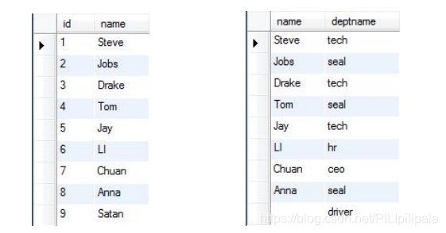

#### 内连接

```sql
select staff.name,deptname from staff,deptno where
staff.name=deptno.name;
12
```

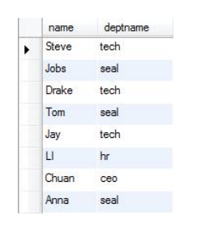

#### 外连接分为左连接和右连接

左连接：包含左边表中所有的记录，右边表中没有匹配的记录显示为 NULL。
右连接：包含右边表中所有的记录，左边表中没有匹配的记录显示为 NULL。

外连接(左连接)：

```sql
select staff.name,deptname from staff left join deptno onstaff.name=deptno.name;
1
```

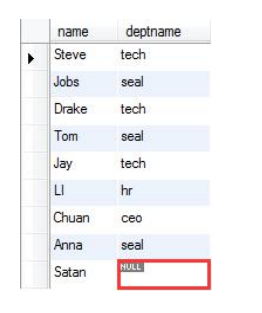
外连接（右连接）：

```sql
select deptname,deptno.name from staff right join deptno ondeptno.name=staff.name;
1
```

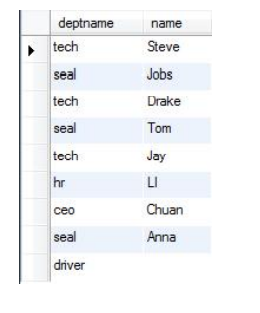