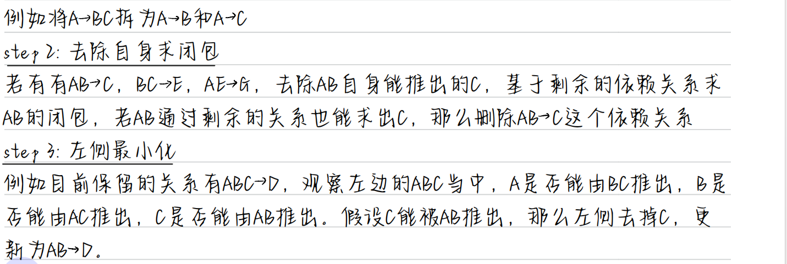

# 数据库

# 第一章：绪论

## 1.1数据库基本概念

**数据**data：描述事物的符号，数据库存储的基本对象。

**数据库**DataBase,DB:计算机内有组织可共享的大量数据的集合。

**数据库管理系统**DataBase Management System,DBMSL：位于用户和操作系统之间的一层数据管理软件。

**数据库系统**DataBase System,DBS：由数据库，数据库管理系统，应用程序和数据库管理员(DBA)组成。

## 1.2数据库的特点

**数据结构化，数据共享性高，冗余度低而且容易扩充，数据独立性高**：物理独立性（应用程序与物理存储相互独立，数据的物理存储改变，应用程序不改变），逻辑独立性（应用程序与逻辑结构相互独立,数据的逻辑结构改变,应用程序不改变）。

## 1.3数据模型

数据模型包括**概念模型**(信息模型）和**逻辑模型**/**物理模型**。

概念模型按用户的观点建模，用于数据库设计，表示方法有E-R模型。

逻辑模型按计算机的观点建模，用于DBMS实现，包括网状模型、层次模型、关系模型等等。

物理模型是对数据最底层的抽象。

**数据模型的组成要素：数据结构，数据操作，数据的完整性约束条件**

1.数据结构:描述系统的静态特性→描述数据库的**组成对象**以及对象之间的**联系**
2.数据操作:描述系统的动态特性→是对数据库中各种对象的实例所允许的**操作的集合**，其类型有**查询和更新(增删改)**
3.数据的完整性约束条件:用以限定符合数据模型的**数据库状态**以及**状态的变化**，以保证数据的正确、有效与相容，完整性约束条件是一组完整性规则的集合

## 1.4数据库系统的三级模式结构：外模式，模式（逻辑模式），内模式


> 1.**外模式**(子模式/用户模式)：数据库用户能够看见和使用的局部数据的逻辑结构和特征的描述，数据库用户的数据视图，是与某应用有关的数据的逻辑表示。
> 2.**模式**(逻辑模式)：数据库中全体数据的逻辑结构和特征的描述，是所有用户的公共数据视图。
>
> 3.**内模式**(存储模式)：数据物理结构和存储方法的描述，是数据在数据库内部的组织方式。

# 第二章：关系数据库

​	**关系数据库**是一种基于**关系模型**的数据库管理系统（DBMS）。在关系数据库中，数据以**表**（或称为关系）的形式进行组织和存储。每个表都由行和列组成，其中每一行代表一个记录，每一列代表一个属性或字段。

## 2.1关系数据结构及形式化定义

1. **关系**：关系是关系数据库中最基本的数据结构，通常用表格（或称为关系）的形式来表示。每个表格都由行和列组成，其中每一行代表一个记录（元组），每一列代表一个属性（字段）。
2. **属性**：属性是关系中的列，每个属性具有一个名称和一个域（取值范围）。
3. **域**：域是属性的取值范围，可以是整数、字符、日期等类型。域的形式化定义取决于其具体类型。
4. **主键**：主键是关系中用来唯一标识每个记录的属性（或属性组合），它的值在整个关系中必须是唯一的。
5. **外键**：外键是关系中用来建立表之间关系的属性，它引用了另一个表中的主键，用于建立表之间的参照完整性约束。
6. **关系操作**：关系操作是对关系进行的操作，包括选择、投影、连接、并、交、差，笛卡尔积等操作，这些操作通过关系代数或关系演算来定义和实现。


## 2.2关系代数

### 函数依赖


### 码


### **关系代数语言**


### 关系代数解题方法


## 2.3关系演算

关系演算是一种用于描述和处理关系数据库中数据的形式化语言，它包括元组关系演算和域关系演算两种主要形式。

关系演算提供了一种形式化的描述方式，可以清晰地表达关系数据库中的查询需求，并且具有严格的数学基础，可以进行形式化推理和证明。通过使用关系演算，可以实现对关系数据库中数据的灵活查询和操作。

# 第三章：关系数据库编程语言SQL

(Structure Query Language 结构化查询语言)，它是对关系型数据库的操作语言。它可以应用到所有关系型数据库中，例如：MySQL、Oracle、SQL Server 等。

## 3.1SQL 分类

- DDL（Data Definition Language）：数据定义语言，用来定义数据库对象：库、表、列等；
- DML（Data Manipulation Language）：数据操作语言，用来定义数据库记录（数据）；
- DCL（Data Control Language）：数据控制语言，用来定义访问权限和安全级别；
- DQL（Data Query Language）：数据查询语言，用来查询记录（数据）

## 3.2DDL：数据定义语言

### 基本操作

查看所有数据库：show databases；

切换数据库：use mydb1，切换到 mydb1 数据库；

### 1.操作数据库

1. 创建数据库：CREATE DATABASE [IF NOT EXISTS] mydb1；

例如：`CREATE DATABASE mydb1`，创建一个名为 mydb1 的数据库。如果这个数据已经存在，那么会报错。
例如 `CREATE DATABASE IF NOT EXISTSmydb1`，在名为 mydb1 的数据库不存在时创建该库，这样可以避免报错。

------

1. 删除数据库：DROP DATABASE [IF EXISTS] mydb1；

例如：`DROP DATABASE mydb1`，删除名为 mydb1 的数据库。如果这个数据库不存在，那么会报错。DROP DATABASE IF EXISTS mydb1，就算 mydb1不存在，也不会的报错。

------

1. 修改数据库编码：ALTER DATABASE mydb1 CHARACTER SET utf8

修改数据库 mydb1 的编码为 utf8。注意，在 MySQL 中所有的 UTF-8 编码都
不能使用中间的`“-”`，即 UTF-8 要书写为 UTF8。

------

### 2.数据类型

MySQL 与 Java、C 一样，也有数据类型MySQL 中数据类型主要应用在列上。
常用类型：

- **int**：整型
- **double**：浮点型，例如 double(5,2)表示最多 5 位，其中必须有 2 位小数，即最大值为 999.99；
- **decimal**：泛型型，在表单线方面使用该类型，因为不会出现精度缺失问题；
- **char**：固定长度字符串类型；(当输入的字符不够长度时会补空格)
- **varchar**：固定长度字符串类型；
- **text**：字符串类型；
- **blob**：字节类型；
- **date**：日期类型，格式为：yyyy-MM-dd；
- **time**：时间类型，格式为：hh:mm:ss
- **timestamp**：时间戳类型；

### 3.操作表

创建表

```sql
CREATE TABLE 表名(
	列名 列类型, 
	列名 列类型,
	...... 
);
12345
```

例如，创建stu表

```sql
CREATE TABLE stu(
	sid CHAR(6), 
	sname VARCHAR(20), 
	age INT, 
	gender VARCHAR(10)
);
123456
```

查看表的结构

DESC 表名；

删除表

DROP TABLE 表名；

修改表

1. 添加列：给 stu 表添加 classname 列
   `ALTER TABLE stu ADD (classname varchar(100));`
2. 修改列的数据类型：修改 stu 表的 gender 列类型为 CHAR(2)
   `ALTER TABLE stu MODIFY gender CHAR(2);`
3. 修改列名：修改 stu 表的 gender 列名为 sex
   `ALTER TABLE stu change gender sex CHAR(2);`
4. 删除列：删除 stu 表的 classname 列
   `ALTER TABLE stu DROP classname;`
5. 修改表名称：修改 stu 表名称为 student
   `ALTER TABLE stu RENAME TO student;`

------

## 3.3DML：数据操作语言

### 1.插入数据

语法 1：
`INSERT INTO 表名(列名 1,列名 2, …) ;`

```sql
INSERT INTO stu(sid, sname,age,gender) VALUES('s_1001', 'zhangSan', 23, 'male');
1
INSERT INTO stu(sid, sname) VALUES('s_1001', 'zhangSan');
1
```

语法 2：
`INSERT INTO 表名 VALUES(值 1,值 2,…);`
因为没有指定要插入的列，表示按创建表时列的顺序插入所有列的值：

```sql
INSERT INTO stu VALUES('s_1002', 'liSi', 32, 'female');
1
```

**注意：所有字符串数据必须使用单引用！**

### 2.修改数据

语法：
`UPDATE 表名 SET 列名 1=值 1, … 列名 n=值 n [WHERE 条件];`

```sql
UPDATE stu SET sname=’zhangSanSan’, age=’32’, gender=’female’ WHERE sid=’s_1001’;
UPDATE stu SET sname=’liSi’, age=’20’WHERE age>50 AND gender=’male’;
UPDATE stu SET sname=’wangWu’, age=’30’WHERE age>60 OR gender=’female’;
UPDATE stu SET gender=’female’WHERE gender IS NULL
UPDATE stu SET age=age+1 WHERE sname=’zhaoLiu’;
12345
```

### 3.删除数据

语法 1：
`DELETE FROM 表名 [WHERE 条件];`

```sql
DELETE FROM stu WHERE sid=’s_1001’003B;
DELETE FROM stu WHERE sname=’chenQi’ OR age > 30;
DELETE FROM stu;
123
```

语法 2：
TRUNCATE TABLE 表名;

```sql
TRUNCATE TABLE stu;
1
```

两者之间的区别：
虽然 TRUNCATE 和 DELETE 都可以删除表的所有记录，但有原理不同。DELETE的效率没有 TRUNCATE 高！
TRUNCATE 其实属性 DDL 语句，因为它是先 DROP TABLE，再 CREATE TABLE。
而且TRUNCATE删除的记录是无法回滚的，但DELETE删除的记录是可以回滚的（回滚是事务的知识！）。

------

## 3.4DCL：数据控制语言

### 1.创建用户

语法：
`CREATE USER ‘用户名’@地址 IDENTIFIED BY '密码';`

```sql
CREATE USER ‘user1’@localhost IDENTIFIED BY ‘123’;
CREATE USER ‘user2’@’%’ IDENTIFIED BY ‘123’;
12
```

### 2.给用户授权

语法：
`GRANT 权限 1, … , 权限 n ON 数据库.* TO ‘用户名’@地址;`

```sql
GRANT CREATE,ALTER,DROP,INSERT,UPDATE,DELETE,SELECT ON mydb1.* TO 'user1'@localhost;
GRANT ALL ON mydb1.* TO user2@localhost;
12
```

### 3.撤销授权

语法：
`REVOKE 权限 1, … , 权限 n ON 数据库.* FROM ‘用户名’@地址;`

```sql
REVOKE CREATE,ALTER,DROP ON mydb1.* FROM 'user1'@localhost;
1
```

### 4.查看用户权限

语法：
`SHOW GRANTS FOR ‘用户名’@地址;`

```sql
SHOW GRANTS FOR 'user1'@localhost;
1
```

### 5.删除用户

语法：
`DROP USER ‘用户名’@地址;`

```sql
DROP USER ‘user1’@localhost;
1
```

### 6.修改用户密码（以root身份）

语法 ：
`use mysql;`
`alter user '用户名'@localhost identified by '新密码';`

------

## 3.5DQL：数据查询语言

数据库执行 DQL 语句不会对数据进行改变，而是让数据库发送结果集给客户端。

语法：
select 列名 ----> 要查询的列名称
from 表名 ----> 要查询的表名称
where 条件 ----> 行条件
group by 分组列 ----> 对结果分组
having 分组条件 ----> 分组后的行条件
order by 排序列 ----> 对结果分组
limit 起始行, 行数 ----> 结果限定

### 创建数据库：Info，在 Info 下创建如下表：

☆学生表：stu：


```sql
CREATE TABLE stu (
	sid CHAR(6), 
	sname VARCHAR(50), 
	age INT, 
	gender VARCHAR(50)
);
INSERT INTO stu VALUES('S_1001', 'liuYi', 35, 'male');
INSERT INTO stu VALUES('S_1002', 'chenEr', 15, 'female');
INSERT INTO stu VALUES('S_1003', 'zhangSan', 95, 'male');
INSERT INTO stu VALUES('S_1004', 'liSi', 65, 'female');
INSERT INTO stu VALUES('S_1005', 'wangWu', 55, 'male');
INSERT INTO stu VALUES('S_1006', 'zhaoLiu', 75, 'female');
INSERT INTO stu VALUES('S_1007', 'sunQi', 25, 'male');
INSERT INTO stu VALUES('S_1008', 'zhouBa', 45, 'female');
INSERT INTO stu VALUES('S_1009', 'wuJiu', 85, 'male');
INSERT INTO stu VALUES('S_1010', 'zhengShi', 5, 'female');
INSERT INTO stu VALUES('S_1011', 'xxx', NULL, NULL);
1234567891011121314151617
```

☆雇员表：emp


```sql
CREATE TABLE emp(
	empno INT, 
	ename VARCHAR(50), 
	job VARCHAR(50), 
	mgr INT, 
	hiredate DATE,
	sal DECIMAL(7,2), 
	comm decimal(7,2), 
	deptno INT
) ;
INSERT INTO emp values(7369,'SMITH','CLERK',7902,'1980-12-17',800,NULL,20);
INSERT INTO emp values(7499,'ALLEN','SALESMAN',7698,'1981-02-20',1600,300,30);
INSERT INTO emp values(7521,'WARD','SALESMAN',7698,'1981-02-22',1250,500,30);
INSERT INTO emp values(7566,'JONES','MANAGER',7839,'1981-04-02',2975,NULL,20);
INSERT INTO emp values(7654,'MARTIN','SALESMAN',7698,'1981-09-28',1250,1400,30);
INSERT INTO emp values(7698,'BLAKE','MANAGER',7839,'1981-05-01',2850,NULL,30);
INSERT INTO emp values(7782,'CLARK','MANAGER',7839,'1981-06-09',2450,NULL,10);
INSERT INTO emp values(7788,'SCOTT','ANALYST',7566,'1987-04-19',3000,NULL,20);
INSERT INTO emp values(7839,'KING','PRESIDENT',NULL,'1981-11-17',5000,NULL,10);
INSERT INTO emp values(7844,'TURNER','SALESMAN',7698,'1981-09-08',1500,0,30);
INSERT INTO emp values(7876,'ADAMS','CLERK',7788,'1987-05-23',1100,NULL,20);
INSERT INTO emp values(7900,'JAMES','CLERK',7698,'1981-12-03',950,NULL,30);
INSERT INTO emp values(7902,'FORD','ANALYST',7566,'1981-12-03',3000,NULL,20);
INSERT INTO emp values(7934,'MILLER','CLERK',7782,'1982-01-23',1300,NULL,10);
123456789101112131415161718192021222324
```

☆部门表：dept


```sql
CREATE TABLE dept(
	deptno INT, 
	dname varchar(14),
	loc varchar(13)
);
INSERT INTO dept values(10, 'ACCOUNTING', 'NEW YORK');
INSERT INTO dept values(20, 'RESEARCH', 'DALLAS');
INSERT INTO dept values(30, 'SALES', 'CHICAGO');
INSERT INTO dept values(40, 'OPERATIONS', 
123456789
```

### 1.基础查询

查询所有列
`SELECT * FROM 表名;`
(* ：通配符，表示所有列)

```sql
SELECT * FROM stu;
1
```

查询指定列
`SELECT 列名 1, 列名 2, …列名 n FROM 表名;`

```sql
SELECT sid, sname, age FROM stu;
1
```

### 2.条件查询

条件查询介绍
条件查询就是在查询时给出 WHERE 子句，在 WHERE 子句中可以使用如下运算符及关键字：

- =、!=、<>、<、<=、>、>=；
- BETWEEN…AND；
- IN(set)；
- IS NULL；
- AND；
- OR；
- NOT；

举例说明
查询性别为女，并且年龄小于 50 的记录
`SELECT * FROM stu`
`WHERE gender='female' AND age<50;`

查询学号为 S_1001，或者姓名为 liSi 的记录
`SELECT * FROM stu`
`WHERE sid ='S_1001' OR sname='liSi';`

查询学号为 S_1001，S_1002，S_1003 的记录
`SELECT * FROM stu`
`WHERE sid IN ('S_1001','S_1002','S_1003')`

查询学号不是 S_1001，S_1002，S_1003 的记录
`SELECT * FROM stu`
`WHERE sid NOT IN ('S_1001','S_1002','S_1003');`

查询年龄为 null 的记录
`SELECT * FROM stu`
`WHERE age IS NULL;`

查询年龄在 20 到 40 之间的学生记录
`SELECT * FROM stu`
`WHERE age>=20 AND age<=40;`
或者
`SELECT * FROM stu`
`WHERE age BETWEEN 20 AND 40;`

查询性别非男的学生记录
`SELECT * FROM stu`
`WHERE gender!='male';`
或者
`SELECT * FROM stu`
`WHERE gender<>'male';`
或者
`SELECT * FROM stu`
`WHERE NOT gender='male';`

查询姓名不为 null 的学生记录
`SELECT * FROM stu`
`WHERE NOT sname IS NULL;`
或者
`SELECT * FROM stu`
`WHERE sname IS NOT NULL;`

------

### 3.模糊查询

`SELECT 字段 FROM 表 WHERE 某字段 Like 条件`
其中关于条件，SQL 提供了两种匹配模式：

1. `%` ：表示任意 0 个或多个字符。可匹配任意类型和长度的字符，有些情
   况下若是中文，请使用两个百分号（%%）表示。
2. `_ `： 表示任意单个字符。匹配单个任意字符，它常用来限制表达式的字 符长度语句。

举例说明
查询姓名由 5 个字母构成的学生记录
`SELECT * FROM stu`
`WHERE sname LIKE '_ _ _ _ _';`

查询姓名由 5 个字母构成，并且第 5 个字母为“i”的学生记录
`SELECT * FROM stu`
`WHERE sname LIKE '_ _ _ _i';`

查询姓名以“z”开头的学生记录
`SELECT * FROM stu`
`WHERE sname LIKE 'z%';`
其中“%”匹配 0~n 个任何字母。

查询姓名中第 2 个字母为“i”的学生记录
`SELECT * FROM stu`
`WHERE sname LIKE '_i%';`

\查询姓名中包含“a”字母的学生记录
`SELECT * FROM stu WHERE sname LIKE '%a%';`

### 4.字段控制查询

去掉重复记录
去除重复记录（两行或两行以上记录中系列的上的数据都相同），例如 emp 表中 sal 字段就存在相同的记录。当只查询 emp 表的 sal 字段时，那么会出现重复记录，那么想去除重复记录，需要使用 DISTINCT：
`SELECT DISTINCT sal FROM emp;`

查看雇员的月薪与佣金之和
因为 sal 和 comm 两列的类型都是数值类型，所以可以做加运算。如果 sal 或 comm 中有一个字段不是数值类型，那么会出错。
`SELECT *,`
`sal+comm FROM emp;`
comm 列有很多记录的值为 NULL，因为任何东西与 NULL 相加结果还是 NULL，所以结算结果可能会出现 NULL。下面使用了把 NULL 转换成数值 0 的函数 IFNULL：
`SELECT *, sal+IFNULL(comm,0) FROM emp;`

给列名添加别名
在上面查询中出现列名为 sal+IFNULL(comm,0)，这很不美观，现在我们给这一列给出一个别名，为 total：
`SELECT *, sal+IFNULL(comm,0) AS total FROM emp;`
给列起别名时，是可以省略 AS 关键字的：
`SELECT *, sal+IFNULL(comm,0) total FROM emp;`

------

### 5.排序

查询所有学生记录，按年龄升序排序
`SELECT * FROM stu`
`ORDER BY sage ASC;`
或者
`SELECT * FROM stu ORDER BY sage;`

查询所有学生记录，按年龄降序排序
`SELECT * FROM stu`
`ORDER BY age DESC;`

查询所有雇员，按月薪降序排序，如果月薪相同时，按编号升序排序
`SELECT * FROM emp`
`ORDER BY sal DESC ,empno ASC;`

------

### 6.聚合函数

聚合函数是用来做纵向运算的函数：

- COUNT()：统计指定列不为 NULL 的记录行数；
- MAX()：计算指定列的最大值，如果指定列是字符串类型，那么使用字符串排序运算；
- MIN()：计算指定列的最小值，如果指定列是字符串类型，那么使用字符串排序运算；
- SUM()：计算指定列的数值和，如果指定列类型不是数值类型，那么计算结果为 0；
- AVG()：计算指定列的平均值，如果指定列类型不是数值类型，那么计算结果为 0；

COUNT：当需要纵向统计时可以使用 COUNT()。

查询 emp 表中记录数：
`SELECT COUNT(*) AS cnt FROM emp;`

查询 emp 表中有佣金的人数：
`SELECT COUNT(comm) cnt FROM emp;`
注意，因为 count()函数中给出的是 comm 列，那么只统计 comm 列非 NULL 的行数。

查询 emp 表中月薪大于 2500 的人数：
`SELECT COUNT(*) FROM emp WHERE sal > 2500;`

统计月薪与佣金之和大于 2500 元的人数：
`SELECT COUNT(*) AS cnt FROM emp WHERE sal+IFNULL(comm,0) > 2500;`
查询有佣金的人数，以及有领导的人数：
`SELECT COUNT(comm), COUNT(mgr) FROM emp;`

SUM 和 AVG：当需要纵向求和时使用 sum()函数。

查询所有雇员月薪和：
`SELECT SUM(sal) FROM emp;`

查询所有雇员月薪和，以及所有雇员佣金和：
`SELECT SUM(sal), SUM(comm) FROM emp;`

查询所有雇员月薪+佣金和：
`SELECT SUM(sal+IFNULL(comm,0)) FROM emp;`

统计所有员工平均工资：
`SELECT SUM(sal), COUNT(sal) FROM emp;`
或者
`SELECT AVG(sal) FROM emp;`

MAX 和 MIN
查询最高工资和最低工资：
`SELECT MAX(sal), MIN(sal) FROM emp;`

### 7.分组查询

分组查询

当需要分组查询时需要使用 `GROUP BY `子句，例如查询每个部门的工资和，这说明要使用部分来分组。

查询每个部门的部门编号和每个部门的工资和：

```sql
SELECT deptno, SUM(sal)
FROM emp
GROUP BY deptno;

1234
```

查询每个部门的部门编号以及每个部门的人数：

```sql
SELECT deptno,COUNT(*)
FROM emp
GROUP BY deptno;
123
```

查询每个部门的部门编号以及每个部门工资大于 1500 的人数：

```sql
SELECT deptno ,COUNT(*)
FROM emp
WHERE sal>1500`
GROUP BY deptno;
1234
```

HAVING 子句

查询工资总和大于 9000 的部门编号以及工资和：

```sql
SELECT deptno, SUM(sal)
FROM emp
GROUP BY deptno
HAVING SUM(sal) > 9000;
1234
```

**注意，WHERE 是对分组前记录的条件，如果某行记录没有满足 WHERE 子句的条件，那
么这行记录不会参加分组；而 HAVING 是对分组后数据的约束。**

### 8.LIMIT：用来限定查询结果的起始行，以及总行数。

查询 5 行记录，起始行从 0 开始
`SELECT * FROM emp LIMIT 0, 5;`
注意，起始行从 0 开始，即第一行开始！

查询 10 行记录，起始行从 3 开始
`SELECT * FROM emp LIMIT 3, 10;`

分页查询
如果一页记录为 10 条，希望查看第 3 页记录应该怎么查呢？
 第一页记录起始行为 0，一共查询 10 行；
 第二页记录起始行为 10，一共查询 10 行；
 第三页记录起始行为 20，一共查询 10 行；

### 9.多表连接查询： 表连接分为内连接和外连接。

他们之间最主要的区别：内连接仅选出两张表中互相匹配的记录，外连接会选出其他不匹配的记录。

例如： 以下是员工表 staff 和职位表 deptno:


#### 内连接

```sql
select staff.name,deptname from staff,deptno where
staff.name=deptno.name;
12
```


#### 外连接分为左连接和右连接

左连接：包含左边表中所有的记录，右边表中没有匹配的记录显示为 NULL。
右连接：包含右边表中所有的记录，左边表中没有匹配的记录显示为 NULL。

外连接(左连接)：

```sql
select staff.name,deptname from staff left join deptno onstaff.name=deptno.name;
1
```


外连接（右连接）：

```sql
select deptname,deptno.name from staff right join deptno ondeptno.name=staff.name;
1
```


## 第四章：数据库安全性

**1、不安全因素**
非授权用户对数据库的恶意存取和破坏，数据库中重要数据的泄露，安全环境的脆弱性。
**2、数据库安全性控制**
用户身份鉴别:1.静态口令鉴别、动态口令鉴别、生物特征鉴别、智能卡鉴别、2.存取控制 3.自主存取控制方法

**8、视图机制**
为不同的用户定义不同的视图，把不需要的数据隐藏，这样用户就不会误操作。

**9、审计**
把对数据库的所有操作都记录到审计日志中，然后就可以通过日志审查这个里面是否有一些非法的行为。

**10、数据加密**
通过一些加密算法，把明文变成密文。这样别人就无法查看。

## 第五章：数据库完整性

**1、数据库的完整性是指数据的正确性和相容性**

正确性:符合现实世界语义
相容性:同一对象在不同表中的数据符合逻辑

**2、维护完整性需要实现的功能**
提供定义完整性约束条件的机制，提供完整性检查的方法，进行违约处理

**3、三大完整性**
1.实体完整性:主码唯一且非空
检查与违约处理:检查主码是否唯一，如果不唯一则拒绝插入或修改；检查主码各个属性是否为空，只要有一个为空就拒绝插入或修改
2.参照完整性:外码的约束
检查:对被参照表和参照表进行增删改操作时可能会破坏参照完整性，必须检查以保证两个表的相容性。

违约处理:外码约束可以在创建参照表时说明不同的违约策略


3.用户定义完整性:属性上约束条件的定义

1.属性上的约束条件
非空 NOT NULL

列值唯一 UNIQUE

检查列值是否满足一个表达式 CHECK
检查和违约处理:当向表中插入元组或者修改属性值时，关系数据库管理系统将检查属性上的约束条件是否被满足，如果不满足则操作被拒绝。

2.元组上的约束条件
在创建表语句CREATE TABLE中可以用检查CHECK短语定义元组上的约束条件，元组级的限制可以设置不同属性之间的取值的相互约束条件。
检查和违约处理:当向表中插入元组或者修改属性值时，关系数据库管理系统将检查元组上的约束条件是否被满足，如果不满足则操作被拒绝。

## 第六章：关系数据理论

### 6.1范式

**（1）1NF**：所有属性都是不可分割的数据项

如果某个属性，例如学校，还可以继续拆分为高中和大学，就不满足1NF了。1NF是关系数据库需要满足的最低要求

**（2）2NF**：在满足1NF的前提下，不包含非主属性对码的部分函数依赖（即每一个非主属性都完全函数依赖于码）

例如在关系R中，码是学号和班级，非主属性是姓名，因为通过学号就能直接

推出姓名了，不需要班级，此处姓名就部分依赖于码了，不满足2NF

**（3）3NF**：在满足2NF的前提下，不包含非主属性对码的传递函数依赖（即码应该直接决定非主属性，不能间接决定）应该直接决定非主属性，不能间接决定），传递函数依赖：若X  Y，Y  Z，且Z  Y，Y  X，有X  Z，此时称Z对X有传递函数依赖。

例如在关系R中，码是客户姓名，非主属性是订单编号和订单负责人，通过客户姓名可以推出他的订单编号，再通过订单编号能推出订单负责人，这种情况下客户姓名和订单负责人是间接决定的，存在传递函数依赖，不满足3NF。

**（4）BCNF**：消除任何属性对候选码的传递依赖，即每一个决定因素都包含码，表现为在函数依赖集当中，左边的都包含候选码（整个属性组！）

### 判断方法与分解方法：

R为{A，B，C，D}

**2NF**（没有部分函数依赖）：若码是AB，F中若为（A  C，AB  D}，对于C，只需要A就能推出，那么C部分函数依赖于码AB，这种情况就不是2NF。

若要分解为2NF，只需将不符合要求的拿出来，即分为R {A，B，D}和R {A，C}，

**3NF**（没有部分函数依赖与传递函数依赖）：若码是AB，F若为{AB  C，C  D}，这里不存在部分函数依赖。但是对于D，需要AB推出C后才能间接推出D，那么D传递函数依赖于AB，不满足3NF。

**BCNF**（没有部分函数依赖，同时每一个决定因素都包含码）：若R是（A，B，C），F是{AC  B，AB  C，B  C}，候选码则是AC和AB。这里不存在

部分函数依赖，但对于B  C来说，决定因素B不包含码，因此它不是BCNF。

### 6.2最小函数依赖集




## 第七章：数据库设计的步骤

**1、需求分析**
调查机构情况与熟悉业务活动，明确用户的需求，确定系统的边界，生成数据字典和用户需求规格说明书

**2、概念结构设计**
将需求分析得到的用户需求抽象为概念模型，绘制E-R图

**3、逻辑结构设计**
将E-R图转换为与DBMS相符合的逻辑结构(包括数据库模式和外模式)，例如E-R图向关系模型转换，再根据规范化理论对数据模型进行优化，设计用户子模式。


**4、物理结构设计**
通常关系数据库物理设计的内容包括关系模式选择存取方法、以及设计关系、索引等数据库文件的物理存储结构

**5、数据库实施**
建立实际数据库结构、试运行、装入数据

**6、数据库运行和维护**
维护数据库的安全性、完整性控制以及系统的转储和恢复；性能的监督、分析和改进；增加新功能；发现错误和修改错误

## 第八章：数据库编程

### **1、嵌入式SQL与主语言之间的通信**

SQL是描述性的面向集合的语句，负责操纵数据库；高级语言语句是过程性的面向记录的语句，负责控制程序流程通信。

在嵌入式SQL中，当主语言为C语言时，语法格式为EXEC SQL <SQL语句>;

当主语言为Java，语法格式为#SQL {<SQL语句>};

嵌入式SQL与主语言之间的通信包括：

①SQL向主语言传递执行状态信息，主要用SQL通信区实现

②主语言向SQL提供参数，主要用主变量实现

③将SQL语句查询数据库的结果交给主语言处理，主要用主变量和游标实现

**SQL通信区**：

SQL语句执行后的执行状态信息将送到SQL通信区中，应用程序从中取出这些信息，据此决定接下来执行的语句

SQL通信区在应用程序中用EXEC SQL INCLUDE SQLCA加以定义

**主变量**：

SQL语句中使用的主语言程序变量简称为主变量（即SQL使用主语言的变量）

输入主变量由应用程序赋值，SQL引用；输出主变量由SQL赋值或设置状态信息，返回应用程序

一个主变量可以附带一个任选的指示变量（整型），用来指示所指主变量的值或条件

主变量名和指示变量名前面要加冒号（:）作为标志

所有主变量和指示变量必须在SQL语句BEGIN DECLARE SECTION与END DECLARE SECTION之间进行说明

**游标**：

SQL是面向集合的，一条SQL语句可以产生或处理多条记录，而主语言是面向记录的，一组变量一次只能存放一

条记录，因此引入游标来协调这两种不同的处理方式

一个数据缓冲区，用来存放SQL语句的执行结果，每个游标区都有自己的名字

**建立连接**：

嵌入式SQL访问数据库必须先连接数据库

建立连接的嵌入式SQL语句为EXEC SQL CONNECT TO target [AS connection-name][USER user-name];

其中target是要连接的数据库服务器，connection-name是可选的连接名

运行过程如果要修改当前连接，对应的嵌入式语句为EXECSQLSETCONNECTIONconnection-name|DEFAULT;

**关闭连接**：

对应的嵌入式SQL语句为EXEC SQL DISCONNECT [connection];

### **2、嵌入式SQL与主语言通信的程序实例**

```sql
EXEC SQL BEGIN DECLARE SECTION;    /*主变量说明开始*/ 

​    char Deptname[20];

​    char Hsno[9];

​    char Hsname[20]; 

​    char Hssex[2];

​    int HSage;

​    int NEWAGE;

EXEC SQL END DECLARE SECTION;       /*主变量说明结束*/

long SQLCODE;

EXEC SQL INCLUDE SQLCA;               /*定义SQL通信区*/
int main(void)                                  /*C语言主程序开始*/
{
    int count = 0;
        char yn;                                   /*变量yn代表yes或no*/    
        printf("Please choose the department name(CS/MA/IS): "); 
        scanf("%s",deptname);                   /*为主变量deptname赋值*/
        EXEC SQL CONNECT TO TEST@localhost:54321 USER "SYSTEM"/"MANAGER";   /*连接数据库TEST*/
        EXEC SQL DECLARE SX CURSOR FOR      /*定义游标SX*/
         SELECT Sno,Sname,Ssex,Sage     /*SX对应的语句*/        
         FROM Student
         WHERE SDept = :deptname;
         EXEC SQL OPEN SX;       /*打开游标SX，指向查询结果的第一行*/
		for ( ; ; )                                 /*用循环结构逐条处理结果集中的记录*/
		{
		EXEC SQL FETCH SX INTO :HSno,:Hsname,:HSsex,:HSage;    /*推进游标，将当前数据放入主变量*/
		if (SQLCA.SQLCODE!= 0)       /*SQLCODE != 0，表示操作不成功*/
		   break;               /*利用SQLCA中的状态信息决定何时退出循环*/
		if(count++ == 0)                      /*如果是第一行的话，先打出行头*/
			printf("\n%-10s %-20s %-10s %-10s\n", "Sno","Sname","Ssex", "Sage");
        printf("%-10s %-20s %-10s %-10d\n", HSno,Hsname,Hssex,HSage);                 /*打印查询结果*/       
        printf("UPDATEAGE(y/n)?");    /*询问用户是否要更新该学生的年龄*/
        do{scanf("%c",&yn);}
        while(yn!='N'&&yn!='n'&&yn!='Y'&&yn!='y');
        if (yn=='y'||yn=='Y')                          /*如果选择更新操作*/
        {
        printf("INPUT NEWAGE:");
		scanf("%d",&NEWAGE);       /*用户输入新年龄到主变量中*/
		EXEC SQL UPDATE Student          /*嵌入式SQL更新语句*/
			SET Sage = :NEWAGE
			WHERE CURRENT OF SX;   /*对当前游标指向的学生年龄进行更新*/
		}
	EXEC SQL CLOSE SX;               /*关闭游标SX，不再和查询结果对应*/
	EXEC SQL COMMIT WORK;                                     /*提交更新*/
	EXEC SQL DISCONNECT TEST;                         /*断开数据库连接*/
}
```


## 第十章：数据库恢复技术

### **1、事务的概念**

（1）事务是数据库操作序列，这些操作要么全做，要么全不做，是不可分割的工作单位.一个事务可以是一个sql语句，一组sql语句，或者整个程序。一般来说，一个程序包含多个事务。
（2）事务是恢复的基本单位，也是并发控制的基本单位。

### **2、定义事务的sql语句**

开始语句：BEGIN TRANSACTION；
结束语句：COMMIT；//表示提交事务的所有操作
或者ROLLBACK；//表示回滚，即事务运行中发生了某种故障，需要对已完成的操作进行撤销，回滚到事务开始的状态。

### **3、事务的4个特性(酸)：原子性，一致性，隔离性，持续性**

1.原子性:一个事务要么全做，要么全不做
一致性:事务执行的结果必须一致.如果一个事务被迫中断，即事务中的一些操作做了，剩下的还没做，且做了的对数据库造成的修改已经存入物理数2.据库的话，就会造成数据库处于不一致的状态.因此事务要么全做，要么全不做，一致性和原子性是密切相关的
3.隔离性:一个事务的执行不能被其他事务干扰
4.持续性(也称为永久性)：一个事务一旦提交，它对数据库中数据的改变应该是永久性的

### **4、数据库系统的故障种类：事物内部的故障、系统故障、介质故障、计算机病毒**

①事务内部的故障

事务内部的故障有的是可以通过事务程序本身发现的，有的是非预期的、不能由事务程序处理的

事务故障的情况下，数据库可能处于不正确的状态。恢复程序要在不影响其他事务运行的情况下，强行回滚该事务，即撤销该事务造成的修改，这类恢复操作称为UNDO（事务撤销）

②系统故障（软故障）

系统故障是指造成系统停止运转的任何事件，使得系统要重新启动（例如硬件错误、操作系统故障、DBMS代码错误、系统断电等等）

系统故障的情况下，在系统重新启动后，恢复子系统除了需要撤销未完成的事务以外，还需要REDO（事务重做）所有已提交的事务

③介质故障（硬故障）

外存故障，如磁盘损坏、磁头碰撞、瞬时强磁场干扰等

④计算机病毒

### **5、数据库恢复技术：数据转储、登记日志文件**

恢复机制涉及的两个关键问题：1、如何建立冗余数据；2、如何利用这些冗余数据实施数据库的恢复

恢复的基本原理：利用存储在后备副本、日志文件和数据库镜像中的冗余数据来重建数据库

建立冗余数据的技术包括：

①数据转储

数据库管理员定期将整个数据库复制到磁带、磁盘或其他存储介质上保存起来，这些备用数据称为后备副本或后援副本。当数据库遭到破坏后可以将后备副本重新装入，但重装后备副本只能将数据库恢复到存储时的状态，要想恢复到故障发生时的状态，则必须重新运行自转储后的所有更新事务。

数据转储分为：静态转储（在系统中无运行事务时进行）、动态转储（转储期间允许对数据库进行存取或修改）

数据转储也可分为：海量转储（每次转储全部数据库）、增量转储（每次只转储上一次转储后更新过的数据）

数据转储方法分为：动态海量转储、动态增量转储，静态海量转储、静态增量转储

②登记日志文件

日志文件是用来记录事务对数据库的更新操作的文件，有两种格式：以记录为单位、以数据块为单位

1.以记录为单位的日志文件

需要登记的内容：各个事务的开始（BEGINTRANSACTION）标记、各个事务的结束（COMMIT/ROLLBACK）

标记、各个事务的所有更新操作

日志记录的内容：事务标识（标明哪个是事务）、操作的类型（增删改）、操作对象（记录内部标识）、更新前数

据的旧值（对插入而言，此项为空值）、更新后数据的新值（对删除而言，此项为空值）

2.以数据块为单位的日志文件

日志记录的内容：事务标识、被更新的数据块

日志文件的作用：

（1）事务故障恢复和系统故障恢复必须用日志文件

（2）在动态转储方式中必须建立日志文件，后备副本和日志文件结合才能有效恢复数据库

（3）在静态转储方式中也可以建立日志文件，当数据库毁坏后可以重新装入后备副本把数据库恢复到转储结束时

刻的正确状态，然后利用日志文件，把已完成的事务进行重做处理，对故障发生时尚未完成的事务进行撤销处理

登记日志文件的两条原则：

（1）登记的次序严格按并发事务执行的时间次序

（2）必须先写日志文件，后写数据库

### **6、不同的数据库系统故障下的恢复策略**

①事务故障的恢复

由系统自动完成，对用户透明：利用日志文件撤销（UNDO）此事务已对数据库进行的修改

②系统故障的恢复

由系统重新启动时自动完成，不需要用户干预：撤销（UNDO）故障发生时未完成的事务，重做（REDO）已完成

的事务

③介质故障的恢复

最严重的一种故障：重装数据库，重做（REDO）已完成的事务

*为避免磁盘介质出现故障影响数据库，许多数据库管理系统提供了数据库镜像功能（复制数据实现）

### **7、具有检查点的恢复技术**

这种技术在日志文件中增加了检查点记录：检查点之前的事务已经做完了，不需要重做，检查点期间和之后的事务

需要重做，可以改善恢复效率。

## 第十一章：并发控制

**1、并发控制：为了保证事务的隔离性和一致性，数据库管理系统需要对并发操作进行正确调度**

并发控制的主要技术有：封锁、时间戳、乐观控制法、多版本并发控制等

并发操作带来的数据不一致性：

①丢失修改：两个事务T1和T2读入同一数据并修改，T2提交的结果破坏了T1提交的结果，导致T1的修改被丢失

②不可重复读：指事务T1读取数据后，事务T2执行更新操作，使T1无法再现前一次读取结果

③读脏数据：事务T1修改某一数据后并将其写回磁盘，事务T2读取同一数据后，T1由于某种原因被撤销，这时T1修改过的数据恢复原值，T2读到的数据就与数据库中的数据不一致

**2、并发控制的基本方法：封锁（X锁、S锁）**

①排他锁/写锁，X锁

若事务T对数据对象A加上X锁，则只允许事务T读取和修改A

事务T释放A上的锁之前：其他事务不能读取和修改A，不能再对A加任何类型的锁

②共享锁/读锁，S锁

若事务T对数据对象A加上S锁，则事务T可以读取A，但不能修改A

事务T释放A上的S锁之前：其他事务可以读取A，可以对A加S锁，但不能修改A，也不能对A加X锁

**3、封锁协议：约定何时申请X锁/S锁、持续时间、何时释放等等**

①一级封锁协议

事务T在修改数据R之前必须先对其加X锁，直到事务结束才释放

②二级封锁协议

事务T在修改数据R之前必须先对其加X锁（一级封锁协议），并且其他事务在读取数据之前必须先对其加S锁，

读完后即可释放S锁

③三级封锁协议

事务T在修改数据R之前必须先对其加X锁（一级封锁协议），并且其他事务在读取数据之前必须先对其加S锁，

直到事务结束才释放（二级封锁协议是读完就能释放）

不同级别的封锁协议和一致性保证：


**4、活锁和死锁**

①活锁

事务T1封锁了数据R，事务T2又请求封锁R，于是T2等待；T3也请求封锁R，当T1释放了R上的封锁之后系统首先批准了T3的请求，T2仍然等待；T4又请求封锁R，当T3释放了R上的封锁之后系统又批准了T4的请求……T2有可能永远等待，产生活锁

避免活锁：采用先来先服务的策略

②死锁

事务T1封锁了数据R1，T2封锁了数据R2，T1又请求封锁R2，因T2已封锁了R2，于是T1等待T2释放R2上的锁，接着T2又申请封锁R1，因T1已封锁了R1，T2也只能等待T1，释放R1上的锁，这样T1在等待T2，而T2又在等待T1，T1和T2两个事务永远不能结束，形成死锁。

解决活锁的方法：

（1）死锁的预防

1.一次封锁法：每个事务必须一次将所有要使用的数据全部加锁，否则就不能继续执行

2.顺序封锁法：预先对数据对象规定一个封锁顺序，所有事务按这个顺序实施封锁

（2）死锁的诊断与解除

诊断：1.超时法：如果一个事务的等待时间超过了规定的时限，就认为发生了死锁

​			2.等待图法：构建事务等待图（有向图：节点表示运行的事务，边表示事务等待的情况），存在回路即死锁

解除：选择一个处理死锁代价最小的事务，将其撤销（UNDO），释放此事务持有的所有的锁

**5、可串行化调度：多个事务并发执行的结果=这些事务按某种次序串行执行的结果**

一个给定的并发调度，当且仅当它是可串行化的，才认为是正确调度。例如现有事务T1和T2，若T1与T2的并

发执行结果与先T1后T2相同，或者与先T2后T1相同，那么这个调度就是正确的，否则就是错误的

**6、冲突可串行化调度**

冲突操作：指不同的事务对用一个数据的读写操作（读和写）和写写操作（写和写）

不同事务的冲突操作和同一事物的两个操作是不能交换的，如果发生交换，自然会发生错误。基于此，如果调度能

保证冲突操作的次序不变，就称为冲突可串行化的调度。冲突可串行化调度一定是可串行化调度。（但是注意，可串

行化调度也有可能不满足冲突可串行化）

**7、两段锁协议（2PL）：所有事务必须分两个阶段对数据项加锁和解锁**

①获得封锁（扩展阶段）：在对任何数据进行读、写操作之前，事务首先要获得对该数据的封锁

②释放封锁（收缩阶段）：在释放一个封锁之后，事务不再申请和获得任何其他封锁

若并发执行的所有事务均遵守两段锁协议，则对这些事物的任何并发调度策略都是可串行化的