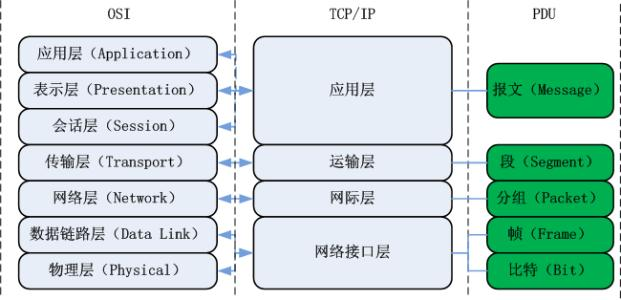
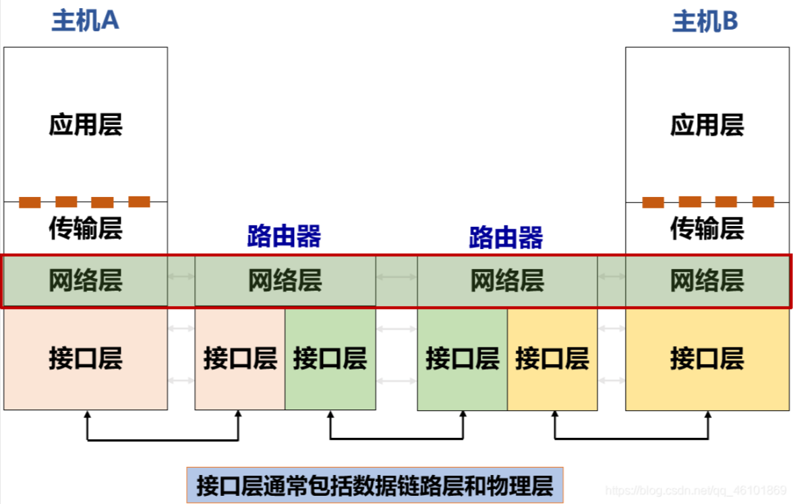

# 第一章：绪论

​	

## 1.1计算机网络的层次结构

## 1.2计算机网络的性能指标

（1）带宽：网络通信线路所能传送数据的能力，单位是bit/s

（2）时延：总时延=发送时延+处理时延+传播时延+排队时延

发送时延：结点将所有bit发往链路所需要的时间

传播时延：一个bit从从链路一端传输到另一端的时间

处理时延和排队时延一般忽略不计

（1）时延带宽积：传播时延*信道带宽

# 第二章：物理层

## 2.1**物理层作用**

连接不同的物理设备，传输比特流。该层为上层协议提供了一个传输数据的可靠的物理媒体。简单的说，物理层确保原始的数据可在各种物理媒体上传输。

## 2.2物理层介质

### **引导性介质**

> 信号在固体介质中传播，例如铜、光纤、同轴电缆

**光纤**

- 高速运行
  高速点对点传输（10-100 Gbps）
- 低错误率
  中继器相距很远，对电磁噪声免疫
  

**双绞线**

- 两根绝缘铜线互相缠绕为一对
- 电话线为1对双绞线，网线为4对双绞线，广泛用于计算机网络（以太网）双向传输
- 第5类：100 Mbps~1 Gbps；第6类：10Gbps
- 传输距离一般为为100米

**同轴电缆**

- 两根同心铜导线，双向传输
- 电缆上的多个频率通道
- 带宽可达100Mbps
- 传输距离一般为200米

### **非引导型介质**

> 信号自由传播，例如无线电（陆地无线电、卫星无线电信道)

**无线电**

- 电磁频谱中各种“波段”携带的信号
- 没有物理“电线”
- 不依赖介质的广播
- 半双工（发送方到接收方）

## 2.3物理层设备

- **中继器【Repeater，也叫放大器】**：同一局域网的再生信号；两端口的网段必须同一协议；5-4-3规程： 10BASE-5以太网中，最多串联4个中继器，5段中只能有3个连接主机；
- **集线器**：同一局域网的再生、放大信号（多端口的中继器）；半双工，不能隔离冲突域也不能隔离广播域。

**信道的基本概念**：信道是往一个方向传输信息的媒体，一条通信电路包含一个发送信道和一个接受信道。

1. 单工通信信道：只能一个方向通信，没有反方向反馈的信道；
2. 半双工通信信道：双方都可以发送和接受信息，但不能同时发送也不能同时接收；
3. 全双工通信信道：双方都可以同时发送和接收。

## 2.4数据交换方式

**电路交换**：传输单位是比特流，像建立一条物理通道。包括建立连接、传输数据和断开连接三部分组成

**报文交换**：传输单位是报文，将报文发给相邻结点，查找转发表，转发给下一个结点。是一种存储-转发类型的网络

**分组交换**：传输单位是报文段，将报文分组转发到相邻结点，查找转发表，转发给下一个结点。是一种存储-转发类型的网络

## 2.5信道复用

（1）**频**分复用：给信号分配唯一的载波频率通过单一媒体传输多个独立的信号；

（2）**时**分复用：每个信号在一个很短时间内占用信道，接着让下一个信号使用

（3）**波**分复用：就是光的频分复用，用光纤传递频率接近的光载波信号

（4）**码**分复用：用一组包含正交的码携带多路信号，可以实现同一时间用相同频带进行通信；

# 第三章：数据链路层

## 3.1数据链路层作用

（1）**封装成帧**：在一端数据前后增加首部和尾部，进行帧定界

（2）**透明传输**：可以防止信息符号和帧定界符混淆

（3）**差错控制**：通常采用**循环冗余码**、**奇偶校验码**进行检错，海明码用于纠错

## 3.2成帧的方式

①带比特填充的定界符法

定界符：两个0比特之间，连续6个1比特，即01111110，0x7E

发送方检查有效载荷：若在有效载荷中出现连续5个1比特，则直接插入1个0比特

接收方的处理：
若出现连续5个1比特，
若下一比特为0，则为有效载荷，直接丢弃0比特；
若下一比特为1，则连同后一比特的0，构成定界符，一帧结束

②物理层编码违例

- 核心思想：**选择的定界符不会在数据部分出现**

## 3.3差错控制

背景

> 链路层存在的一个问题：**信道的噪声导致数据传输问题**
>
> - **差错**（ incorrect ）：数据发生错误
> - **丢失**（ lost ）：接收方未收到
> - **乱序**（out of order）：先发后到，后发先到
> - **重复**（repeatedly delivery）：一次发送，多次接收
>
> 解决方案：**差错检测与纠正、确认重传**
>
> - 确认：接收方校验数据（差错校验），并给发送方应答，防止差错
> - 定时器：发送方启动定时器，防止丢失
> - 顺序号：接收方检查序号，防止乱序递交、重复递交

**常用的检错码包括：**

### ①奇偶检验 (Parity Check)

1位奇偶校验是最简单、最基础的检错码。

1位奇偶校验：增加1位校验位，可以检查奇数位错误。

### ②校验和 (Checksum)

主要用于TCP/IP体系中的网络层和传输层

### ③循环冗余校验 (Cyclic Redundancy Check，CRC)

数据链路层广泛使用的校验方法

**CRC校验码计算方法**

- 设原始数据D为k位二进制位模式
- 如果要产生n位CRC校验码，事先选定一个n+1位二进制位模式G (称为生成多项式，收发双方提前商定)，G的最高位为1
- 将原始数据D乘以2^n （相当于在D后面添加 n 个 0），产生k+n位二进制位模式，用G对该位模式做模2除，得到余数R（n位，不足n位前面用0补齐）即为CRC校验码

CRC校验码计算示例

- D = 1010001101
- n = 5
- G = 110101 或 G = x5 + x4 + x2 + 1
- R = 01110
- 实际传输数据：101000110101110
  

## 3.4流量控制

可能出现发送方发送数据能力大于接收方接收数据能力，导致后者来不及接收所有数据而造成数据丢失，所以要进行流量控制，限制发送方的数据流量，使其发送速率不超过接收方的能力。

（1）停止等待协议：发送窗口=接收窗口=1，发送方每发送一帧等到接收方应答后才能发送下一帧。

（2）后退n帧协议：发送窗口>1，接收窗口=1，发送方可以连续发送帧，当接收方发现失序时，发送给发送方最后一个接收到的数据，发送方需要发送这个数据之后的所有数据。

（3）选择重传协议：发送窗口>1,接收窗口>1,在发生失帧时，只需要重传出现差错的数据帧。

## 3.5媒体接入控制 MAC (Medium Access Control)子层

数据链路层分为两个子层：
**MAC子层**：介质访问
**LLC子层**：承上启下（弱层）

### 1.信道分配问题

**① 时分多址接入-TDMA**

TDMA: time division multiple access

- 按顺序依次接入并使用信道
- 每个用户使用固定且相同长度的时隙
- 某时隙轮到某用户使用时，该用户没有数据要发送，则该时隙被闲置

例子: 6-user LAN, 1,3,4时隙有数据发送, 2,5,6时隙被闲置

**② 频分多址接入-FDMA**

FDMA: frequency division multiple access

- 信道总频带被划分为多个相同宽度的子频带
- 每个用户占用一个子频带，不管用户是否有数据发送

例子: 6-user LAN, 1,3,4频带有数据发送, 2,5,6频带被闲置

### 2.多路访问协议

#### 2.1 随机访问协议

特点：冲突不可避免

###### ①ALOHA

**纯ALOHA协议**

原理：想发就发！

特点：

- 冲突：两个或以上的帧
- 随时可能冲突
- 冲突的帧完全破坏
- 破坏了的帧要重传

**分隙ALOHA**

- 分隙ALOHA是把时间分成时隙（时槽）
- 时隙的长度对应一帧的传输时间。
- 帧的发送必须在时隙的起点。
- 冲突只发生在时隙的起点
  

###### ②载波侦听多路访问协议CSMA

特点：“先听后发”
改进ALOHA的侦听/发送策略分类

**非持续式CSMA**

1.特点
①经侦听，如果介质空闲，开始发送
②如果介质忙，则等待一个随机分布的时间，然后重复步骤①

2.好处
等待一个随机时间可以减少再次碰撞冲突的可能性

3.缺点
等待时间内介质上如果没有数据传送，这段时间是浪费的

------

**持续式CSMA**

**p-持续式CSMA**

1.特点

①经侦听，如介质空闲，那么以 p的概率 发送，以(1–p)的概率延迟一个时间单元发送
②如介质忙，持续侦听，一旦空闲重复①
③如果发送已推迟一个时间单元，再重复步骤①

**1-持续式CSMA**

1.特点
①经侦听，如介质空闲，则发送
②如介质忙，持续侦听，一旦空闲立即发送
③如果发生冲突，等待一个随机分布的时间再重复步骤①

2.好处：持续式的延迟时间要少于非持续式

3.主要问题：如果两个以上的站等待发送，一旦介质空闲就一定会发生冲突

4.注意
1-持续式是p-持续式的特例

#### 2.2 受控访问协议

特点：克服了冲突

###### ①位图协议（预留协议）

竞争期：在自己的时槽内发送竞争比特

- 举手示意
- 资源预留

传输期：按序发送

- 明确的使用权，避免了冲突

###### ②令牌传递

令牌：发送权限

令牌的运行：发送工作站去抓取，获得发送权

- 除了环，令牌也可以运行在其它拓扑上，如令牌总线
- 发送的帧需要目的站或发送站将其从共享信道上去除；防止无限循环

缺点：令牌的维护代价

###### ③二进制倒计数协议

站点：编序号，序号长度相同
竞争期：有数据发送的站点从高序号到低序号排队，高者得到发送权
特点：高序号站点优先

#### 2.3 有限竞争协议

利用上述二者的优势

###### ①自适应树搜索协议（Adaptive Tree Walk Protocol）

- 在一次成功传输后的第一个竞争时隙，所有站点同时竞争。
- 如果只有一个站点申请，则获得信道。
- 否则在下一竞争时隙，有一半站点参与竞争（递归），下一时隙由另一半站点参与竞争
- 即所有站点构成一棵完全二叉树。
  

### 3.虚拟局域网VLAN

**广播域（Broadcasting Domain）**

- 广播域是广播帧能够到达的范围；
- 缺省情况下，交换机所有端口同属于一个广播域，无法隔离广播域；
- 广播帧在广播域中传播，占用资源，降低性能，且具有安全隐患。

**VLAN是一个在物理网络上根据用途，工作组、应用等来逻辑划分的局域网络，与用户的物理位置没有关系。**

通过路由器或三层交换机进行VLAN间路由，实现VLAN间通信。

VLAN类型

- 基于端口的VLAN
  
- 基于MAC地址的VLAN
  
- 基于协议的VLAN
  
- 基于子网的VLAN
  

### 4.无线局域网WLAN

> 无线局域网（Wireless Local Area Network，WLAN)：指以无线信道作为传输介质的计算机局域网

**基础架构模式（Infrastructure）**

# 第四章：网络层

## 4.1网络层概述

网络层在数据链路层提供的两个相邻端点之间的数据帧的传送功能上，进一步管理网络中的数据通信，将数据设法从源端经过若干个中间节点传送到目的端，从而向运输层提供最基本的端到端的数据传送服务。

## 4.2网络层作用

- 路由（控制面）
  - 选择数据报从源端到目的端的路径
  - 核心：路由算法与协议
- 转发（数据面）
  - 将数据报从路由器的输入接口传送到正确的输出接口

## 4.3Internet网际协议

***\*网络协议的三要素：\****

语法：规定了传输数据的格式

语义：规定了所要完成的功能

同步：规定了各种操作的执行顺序

### IPv4协议

**IPv4协议**（寻址和分片），网际协议版本4，一种无连接的协议，是互联网的核心，也是使用最广泛的网际协议版本，其后继版本为IPv6。

**IPv4数据报格式：**

- **版本**： 4bit ，表示采用的IP协议版本
- **首部长度**： 4bit，表示整个IP数据报首部的长度
- **区分服务**： 8bit ，该字段一般情况下不使用
- **总长度**： 16bit ，表示整个IP报文的长度,能表示的最大字节为2^16-1=65535字节
- **标识**： 16bit ， IP软件通过计数器自动产生，每产生1个数据报计数器加1；在ip分片以后，用来标识同一片分片
- **标志**： 3bit，目前只有两位有意义。
  MF，置1表示后面还有分片，置0表示这是数据报片的最后1个；
  DF，不能分片标志，置0时表示允许分片
- **片偏移**： 13bit，表示IP分片后，相应的IP片在总的IP片的相对位置
- **生存时间TTL(Time To Live)** ：8bit,表示数据报在网络中的生命周期，用通过路由器的数量来计量，即跳数（每经过一个路由器会减1）
- **协议**：8bit，标识上层协议（TCP/UDP/ICMP…）
- **首部校验和**：16bit ，对数据报首部进行校验，不包括数据部分
- **源地址**：32bit，标识IP片的发送源IP地址
- **目的地址**：32bit，标识IP片的目的地IP地址
- **选项**：可扩充部分，具有可变长度，定义了安全性、严格源路由、松散源路由、记录路由、时间戳等选项
- **填充**：用全0的填充字段补齐为4字节的整数倍

**IPv4分片策略**

- IPv4分组在传输途中可以多次分片
  - 源端系统，中间路由器（可通过标志位设定是否允许路由器分片，DF标志位）
- IPv4分片只在目的IP对应的目的端系统进行重组
- IPv4分片、重组字段在基本IP头部
  - 标识、标志、片偏移
- IPv6分片机制有较大变化（见IPv6部分的介绍）

### IP地址

- **IP地址**，网络上的每一台主机（或路由器）的每一个接口都会分配一个全球唯一的32位的标识符
- 将IP地址划分为固定的类，每一类都由两个字段组成
- 网络号相同的这块连续IP地址空间称为地址的**前缀**，或**网络前缀**
- IP地址共分为A、B、C、D、E五类，A类、B类、C类为单播地址
- IP地址的书写采用点分十进制记法，其中每一段取值范围为0到255

**IP特殊地址**

**子网划分**

- 子网划分(subnetting)，在网络内部将一个网络块进行划分以供多个内部网络使用，对外仍是一个网络。
- 子网掩码(subnet mask )，与 IP 地址一一对应，是32 bit 的二进制数，置1表示网络位，置0表示主机位。
- 子网划分减少了 IP 地址的浪费、网络的组织更加灵活、便于维护和管理。

### ARP地址解析协议

网络设备有数据要发送给另一台网络设备时，必须要知道对方的网络层地址（即IP地址）。IP地址由网络层来提供，但是仅有IP地址是不够的，IP数据报文必须封装成帧才能通过数据链路进行发送。数据帧必须要包含目的MAC地址，因此发送端还必须获取到目的MAC地址。通过目的IP地址二获取的MAC地址的过程是由ARP（Address Resolution Protocol）协议来实现的。

**IP 与 MAC地址**

###  ICMP: 互联网控制报文协议

- ICMP 允许主机或路由器报告差错情况和提供有关异常情况的报告
- 由主机和路由器用于网络层信息的通信
- ICMP 报文携带在IP 数据报中： IP上层协议号为1

## 4.4路由算法

根据路由算法是否随网络的通信量或拓扑自适应划分

- 静态路由选择策略（非自适应路由选择）
- 动态路由选择策略（自适应路由选择）

### 1.距离向量路由

**算法基本思想**

- 每个节点周期性地向邻居发送它自己到某些节点的距离向量；
- 当节点x接收到来自邻居的新DV估计，它使用B-F方程更新其自己的DV :
  Dx(y) ← minv{c(x,v) + Dv(y)} for each node y ∊ N
- 上述过程迭代执行，Dx(y)收敛为实际最小费用 dx(y)

距离向量算法特点：**迭代的、分布式的**

- 每次本地迭代由下列引起: 本地链路费用改变、邻居更新报文
- 分布式:各节点依次计算，相互依赖

**算法过程**

- 路由器启动时初始化自己的路由表
  - 初始路由表包含所有直接相连的网络路径，距离均为0
    
- 路由器周期性地向其相邻路由器广播自己知道的路由信息
- 相邻路由器可以根据收到的路由信息修改和刷新自己的路由表
  
- 路由器经过若干次更新后，最终都会知道到达所有网络的最短距离
- 所有的路由器都得到正确的路由选择信息时网络进入“**收敛**”（convergence）状态

**好消息传播快，坏消息传播慢**，是距离向量路由的一个主要缺点。

### 2.链路状态路由

### 3.层次路由

### 4.广播路由

**广播（Broadcasting）**：源主机同时给全部目标地址发送同一个数据包

## 4.5 Internet路由协议

### 1.路由选择协议RIP

> - 算法简单，收敛慢，需要交换的信息量较大，中小型网络

- 路由选择协议RIP（ Routing Information Protocol）是基于距离矢量算法的协议
- 使用**跳数衡量**到达目的网络的**距离**
  - RIP 认为一个**好的路由**就是它通过的路由器的数目少，即“**距离短**”
  - RIP 允许一条路径最多只能包含 15 个路由器
- RIP协议的基本**思想**
  - 仅和**相邻路由器**交换信息
  - 路由器交换的内容是自己的**路由表**
  - 周期性更新：**30s**

工作过程

（1）初始化

（2）周期性更新

### 2. BGP-外部网关路由协议

路由协议

- 内部网关协议 IGP： 有 RIP 和OSPF、ISIS 等多种具体的协议
- 外部网关协议 EGP：目前使用的协议就是 BGP

BGP**功能**

- eBGP：从相邻的AS获得网络可达信息
- iBGP： 将网络可达信息传播给AS内的路由器
- 基于网络可达信息和策略决定到其他网络的“最优”路由

BGP会话: 两个BGP路由器通过TCP连接交换BGP报文

**BGP路径通告**

## 4.6路由器的工作原理

### 1.路由器概述

### 2.路由器控制层

### 3.路由器数据层

## 4.7虚拟专用网VPN(Virtual Private Network)

### 1.VPN**原理**

- VPN指利用公用网络架设专用网络的远程访问技术
- VPN通过隧道技术在公共网络上模拟出一条点到点的逻辑专线，从而达到安全数据传输的目的

- VPN对数据机密性和完整性的保护

### 2.VPN的实现方式

用VPN连接合作伙伴

### 3.用VPN实现专用网络的远程访问

## 

# 第五章：传输层

### 传输层概述

- 传输层位于应用层和网络层之间：
  - 基于网络层提供的服务，向分布式应用程序提供通信服务
- 按照因特网的“端到端”设计原则：
  - **应用程序只运行在终端上**，即不需要为网络设备编写程序
- 站在应用程序的角度：
  - 传输层应提供**进程之间本地通信的抽象**：即运行在不同终端上的应用进程仿佛是直接连在一起的

## 5.1套接字(**socket**)

**应用程序**和**网络**之前的一扇门（接口API）

1.发送报文->将报文推到**门**外

2.门外**因特网**将报文送到接受进程的**门口**

3.接受进程打开**门**，即可收到报文

### 1.传输层的作用

- 传输层可以通过差错恢复、重排序等手段提供可靠、按序的交付服务

#### 因特网传输层提供的服务

- 最低限度的**传输**服务：UDP协议
  - 将终端-终端的数据交付扩展到进程-进程的数据交付
  - 报文检错
- **增强**服务：TCP协议
  - 可靠数据传输
  - 流量控制
  - 拥塞控制

### 2.传输层的基本服务——复用和分用

传输层基本服务：将主机间交付扩展到进程间交付，通过复用和分用实现

- **复用**：
  发送方**传输层**将套接字标识置于报文段中，交给**网络层**
- **分用**：
  接收方传输层根据报文段中的套接字**标识**，将**报文段**交付到正确的**套接字**

## 5.2 UDP协议（User Datagram Protocol: 用户数据报协议）

**UDP协议特点**

> UDP是**无连接**协议；
>
> UDP**不能保证可靠的交付数据**；
>
> UDP是**面向报文传输**的；
>
> UDP**没有拥塞控制**；
>
> UDP**首部开销**很小。

- UDP报文：
  - 报头：携带协议处理需要的信息
  - 载荷（payload）：携带上层数据
- 用于复用和分用的字段：
  - 源端口号
  - 目的端口号
- 用于检测报文错误的字段：
  - 报文总长度
  - 校验和（checksum）

**UDP适合的应用：**

容忍丢包但对延迟敏感的应用：如流媒体
以单次请求/响应为主的应用：如DNS

## 5.3 TCP协议(Transmission Control Protocol: 传输控制协议)

Tcp协议功能：

1. 对应用层报文进行**分**段和重组；
2. 面向应用层实现**复**用与分解；
3. 实现端到端的**流**量控制；
4. **拥**塞控制；
5. 传输层**寻**址；
6. 对收到的报文进行**差错**检测（首部和数据部分都检错）；
7. 实现进程间的端到端**可靠**数据传输控制。

**TCP协议的特点：**

- TCP是面向**连接**的协议；
- TCP是面向**字节流**的协议；
- TCP的一个连接有两端，即**点对点**通信；
- TCP提供可靠的传输服务；
- TCP协议提供**全双工**通信（每条TCP连接只能一对一）；

### 1.TCP协议的流量控制

### 2.TCP的三次握手和四次挥手

> 三次挥手我们也常称为“请求 -> 应答 -> 应答之应答”的三个回合:为了建立**连接**

建立TCP连接：

- 双方都同意建立连接（知晓另一方想建立连接）
- 初始化连接参数（序号，MSS等）

四次挥手：目的就是确保**断开连接**时双方都是**确认结束**的状态

### 3.TCP协议的拥塞控制

拥塞控制与流量控制的区别：流量控制考虑**点对点的通信量的控制**，而拥塞控制考虑**整个网络**，是全局性的考虑。

拥塞控制的方法：**慢启动算法+拥塞避免算法**。

**慢开始和拥塞避免：**

1. 【**慢开始**】拥塞窗口从1指数增长；
2. 到达阈值时进入【**拥塞避免】**，变成+1增长；
3. **【超时】**，阈值变为当前cwnd的一半（不能<2）；
4. 再从【**慢开始**】，拥塞窗口从1指数增长。

**快重传和快恢复：**

1. 发送方连续收到**3个冗余ACK**，执行【**快重传**】，不必等计时器超时；
2. 执行【**快恢复**】，阈值变为当前cwnd的一半（不能<2），并从此**新的ssthresh**点进入【**拥塞避免】**。

# 第六章：应用层

**应用层概述**

- 每个应用层协议都是为了解决某一应用问题

  ，通过位于不同主机中的多个应用进程之间的通信和协同工作来完成

  - 两台主机通信实际是其对应的两个应用进程(process)在通信
  - **应用进程**: 为解决具体应用问题而彼此通信的进程

- 应用层的具体内容就是规定应用进程在通信时所遵循的协议

  - 客户/服务器（C/S, Client/Server）方式
  - 对等（P2P，Peer to Peer）方式

## 6.1域名系统DNS

DNS（Domain Name System:域名系统）**【C/S，UDP，端口53】**：解决IP地址复杂难以记忆的问题,存储并完成自己所管辖范围内主机的 域名 到 IP 地址的映射。

**域名解析的顺序：**

【1】浏览器**缓存**，【2】找本机的**hosts文件**，【3】路由缓存，【4】找DNS服务器（本地域名、顶级域名、根域名）->迭代解析、递归查询。

1.IP—>DNS服务—>便于记忆的域名
  2.域名由点、字母和数字组成，分为顶级域（com，cn，net，gov，org）、二级域（baidu,taobao,qq,alibaba）、三级域（www）(12-2-0852)

## 6.2WWW体系结构与HTTP协议

**服务器**

- Web页面（HTML文档）：包含多种对象或链接
- Web对象（包括：静态对象和动态对象）：可以是 HTML文档、 图像文件、视频文件、声音文件、脚本文件等
- 对象用URL（统一资源定位符）编址：协议类型://主机名:端口//路径和文件名

**客户端**

- 发出请求、接收响应、解释HTML文档并显示
- 有些对象需要浏览器安装插件

**HTTP请求报文方式：**

1. **GET**：请求指定的页面信息，并返回实体主体；(获取指定的服务端资源)
2. **POST**：向指定资源提交数据进行处理请求；（提交数据到服务端）
3. **DELETE**：请求服务器删除指定的页面；（删除指定的服务端资源）
4. **HEAD**：请求读取URL标识的信息的首部，**只**返回报文头；
5. **OPETION**：请求一些选项的信息；
6. **PUT**：在指明的URL下存储一个文档。

HTTPS(Secure)是安全的HTTP协议，**端口号443**。基于HTTP协议，通过SSL或TLS提供加密处理数据、验证对方身份以及数据完整性保护。

# 第七章：网络安全